[TOC]

# Wind-EV Dispatch Project 综合技术白皮书

## 项目总览 (Project Overview)

本项目是《能源互联网导论》大作业的全链条代码实现，旨在研究并优化含大规模风电及电动汽车（EV）接入的区域能源互联网调度问题。项目基于真实风电出力预测、基础电网负荷数据以及 4000 余辆私家车的真实出行特征，采用分层分级的建模思路构建了完整的能量管理与响应系统（EMS）。

项目完整覆盖了以下核心链路：
1. 底层出行的**无序充电负荷基准仿真**。
2. 避免维数灾难的 **EV 集群充放电潜力聚合建模**。
3. 顶层系统级混合整数二次规划（MIQP）**最优经济调度**。
4. 探究规模效应的 **EV 渗透率敏感性分析**。
5. 自顶向下的 **EV 调度指令降阶分解与单车分配**。
6. 面向用户侧激励的 **动态电价响应与局部搜索寻优**。

本项目证明了：有序充电及车网互动（V2G）机制不仅能实现电网的削峰填谷，更能大幅提高夜间风电消纳率；合理设计的动态电价体系可以引导用户行为趋近全局最优，实现系统级与用户侧的双赢。

---

## 核心架构与业务流图 (Architecture Diagram)

本项目采用松耦合的模块化设计，各个分析层级的数据通过标准化格式进行交互。数据流向与核心模块的交互关系如下所示：

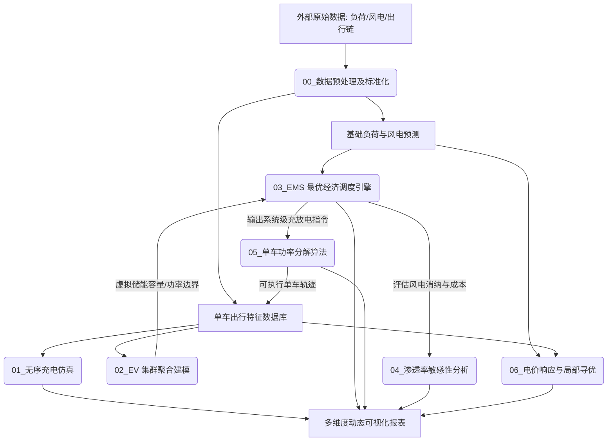

---

## 模块化技术细节 (Modular Technical Details)

### 1. 无序充电基准仿真 (01_unordered_charging)

#### 算法原理与优势
无序充电是研究车网互动的基准（Baseline）。本算法模拟车辆“即插即充”行为，车辆到达后以最大允许功率充电，直到达到目标 SOC 或离开。算法在矩阵维度上直接计算所有车辆的逐时段充电功率，避免了低效的循环操作。

#### 仿真结果展示
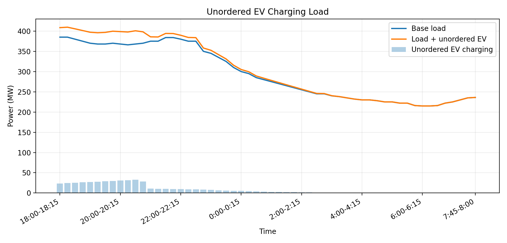
*(图注：在即插即充模式下，晚高峰期间的 EV 充电与居民基础负荷产生严重叠加，形成了“峰上加峰”的极端电网压力。)*

#### 核心代码 (Code Snippets)

```python
for t in range(MAIN_PERIODS):
    # 筛选当前时段在网且仍有充电需求的车辆
    can_charge = availability[:, t] & (remaining_battery_need_kwh > 1e-9)
    if not np.any(can_charge):
        continue
    full_slot_battery_kwh = p_ch_kw * eta_ch * dt_h
    # 当前时段充电功率受到最大功率和剩余需求的双重限制
    p_this_kw = np.minimum(p_ch_kw, remaining_battery_need_kwh / (eta_ch * dt_h))
    p_ev_matrix_kw[can_charge, t] = p_this_kw[can_charge]
    # 扣除已充电量
    remaining_battery_need_kwh[can_charge] -= np.minimum(
        remaining_battery_need_kwh[can_charge],
        full_slot_battery_kwh,
    )
```

---

### 2. EV 集群边界聚合 (02_ev_aggregate)

#### 算法原理与优势
为了避免在顶层 EMS 调度中引入数千个维度的单车决策变量导致“维数灾难”，本模块采用了**虚拟储能系统（VESS）**模型对 EV 集群进行时域上的平移映射和上卷聚合。该算法将车辆的复杂连通性，严格等效为一个带有动态时变容量边界和功率边界的单一虚拟电池。

#### 仿真结果展示
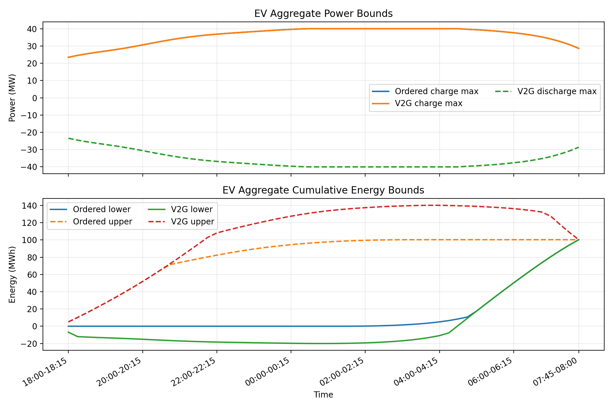
*(图注：图表展现了集群层面所能提供的最大充放电功率边界，以及在保证所有车辆满电离网前提下，系统能容忍的累积能量上下边界。)*

#### 核心公式 (Core Formulas)
对于第 $k$ 个时段，集群累积能量的下界 $E_{\min}(k)$ 和上界 $E_{\max}(k)$ 的计算基于“最晚补能”与“尽早补能”的物理极限：

$$
E_{\min}(k) = \max(\Delta E_{\min}, E_{need} - P_{ch} \cdot \eta_{ch} \cdot \Delta t \cdot N_{remain})
$$

$$
E_{\max}(k) = \min(\Delta E_{\max}, P_{ch} \cdot \eta_{ch} \cdot \Delta t \cdot N_{elapsed})
$$

---

### 3. EMS 顶层优化调度 (03_ems_dispatch)

#### 已有输入条件与边界可视化
在进入全局优化前，EMS 调度引擎需要融合两大核心边界条件：
1. **系统基础供需（由组员 A 提供）**：
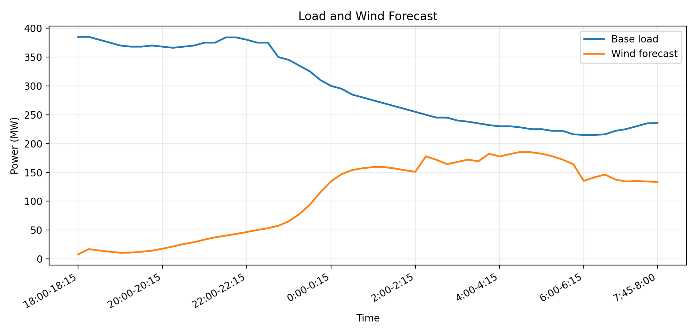
*(图注：蓝色实线代表晚间的居民基础负荷，绿色虚线代表风电预测出力。可以明显看出，风电大发时段集中在午夜至凌晨，此时基础负荷恰好处于低谷，这种供需错位直接导致了夜间的“弃风”现象，也为 EV 的填谷提供了最佳窗口。)*

2. **EV 集群动态约束（由组员 B 提供）**：

*(图注：在每个 15 分钟级的调度时段内，EV 集群能够提供的最大充电功率（上界）与放电功率（下界）并非定值，而是随着车辆的到达与离开动态变化；同时，虚拟储能的总能量不仅受到绝对容量限制，还受到车辆补能需求（尽早充与最晚充）的收窄约束。)*

#### 算法原理与问题建模 (MIQP)
该模块是整个调度系统的“中央大脑”，负责统筹热电机组出力、风电消纳以及 EV 的充放电行为。
在 V2G 模式下，系统物理层面严格要求电池不能“边充边放”（否则将产生严重的虚假循环计算，平白增加能量损耗和结算费用）。为了在数学上严谨刻画这一互斥条件，模型中显式引入了 0-1 整数状态变量 $z \in \{0, 1\}$，并采用经典的 **big-M 法** 进行边界约束建模。

**为何是混合整数二次规划（MIQP）？**
由于热电机组的发电成本通常被拟合为关于出力功率的二次凸函数（包含 $a P_{th}^2$ 项），这使得目标函数呈现非线性（二次型）；而为了实现状态互斥又加入了离散的 0-1 整数变量。因此，整个优化模型从普通的连续二次规划（QP）骤然升级为 NP-Hard 级别的**混合整数二次规划（MIQP, Mixed-Integer Quadratic Programming）**问题。

#### MIQP 数学模型详述 (Mathematical Formulation)

**1. 决策变量 (Decision Variables)**
对于每一个调度时段 $t \in \{1, 2, \dots, T\}$（本算例中 $T=56$，时间步长 $\Delta t = 0.25h$）：
*   **$P_{th, i}(t)$**：第 $i$ 台传统火电机组在时段 $t$ 的输出功率（连续变量）。
*   **$P_{ev, ch}(t)$**：EV 虚拟集群在时段 $t$ 的总充电功率（连续变量）。
*   **$P_{ev, dis}(t)$**：EV 虚拟集群在时段 $t$ 的总放电功率（连续变量）。
*   **$z(t)$**：状态互斥标识位，0-1 整数变量。当 $z(t)=1$ 时表示该时段集群处于充电通道，当 $z(t)=0$ 时表示处于放电通道（离散整数变量，也是 MIQP 问题的核心根源）。
*   **$E_{ev}(t)$**：EV 集群在时段 $t$ 结束时的累积虚拟电池能量（连续状态变量）。

**2. 目标函数 (Objective Function)**
目标为最小化整个调度周期内系统的总运行综合成本，由火电机组的二次发电成本和 EV 集群的充放电双向结算成本（给用户的放电补贴扣减向其收取的充电费）构成：

$$
\min J = \sum_{t=1}^{T} \sum_{i=1}^{N_{th}} \left( a_i P_{th, i}^2(t) + b_i P_{th, i}(t) + c_i \right) \Delta t + \sum_{t=1}^{T} \left( fee_{dis} \cdot P_{ev,dis}(t) - fee_{ch} \cdot P_{ev,ch}(t) \right) \Delta t
$$

> **说明**：$a_i, b_i, c_i$ 为机组的二次能耗特性系数，$fee_{ch}$ 和 $fee_{dis}$ 分别为向 EV 用户收取的充电电价与支付的放电补偿电价。引入 $P_{th,i}^2$ 使目标函数呈现非线性的**二次型 (Quadratic)** 特征。

**3. 约束条件 (Constraints)**

*   **约束 3.1：系统功率实时平衡**
    每个时段的总供给必须实时匹配总需求（基础负荷扣除风电后叠加 EV 带来的净负荷）：
    $$
    \sum_{i=1}^{N_{th}} P_{th, i}(t) + P_{wind}(t) = Load_{base}(t) + P_{ev,ch}(t) - P_{ev,dis}(t), \quad \forall t
    $$

*   **约束 3.2：火电机组出力上下限**
    $$
    P_{th, i}^{\min} \le P_{th, i}(t) \le P_{th, i}^{\max}, \quad \forall t, \forall i
    $$

*   **约束 3.3：充放电状态互斥 (Big-M 法)**
    为避免优化器寻找捷径产生同时充放电的虚假循环损耗，采用经典 Big-M 法结合整数变量 $z(t) \in \{0, 1\}$ 隔离双向潮流：
    $$
    0 \le P_{ev,ch}(t) \le P_{ch}^{\max}(t) \cdot z(t), \quad \forall t
    $$
    $$
    0 \le P_{ev,dis}(t) \le P_{dis}^{\max}(t) \cdot (1 - z(t)), \quad \forall t
    $$
    > **说明**：此处的大 M 即为 02 模块聚合所得的时变功率上界 $P_{ch}^{\max}(t)$ 与 $P_{dis}^{\max}(t)$。这四个边界不等式也是该问题演变成**混合整数 (Mixed-Integer)** 规划的数学本质。

*   **约束 3.4：虚拟储能动态能量追踪与边界收口**
    根据状态空间方程，需保证每个时段结束后的集群能量不突破物理容量上下限（尽早充与最晚充的能量边界，由 02 模块提供）：
    $$
    E_{ev}(t) = E_{ev}(t-1) + \left( P_{ev,ch}(t) \cdot \eta_{ch} - \frac{P_{ev,dis}(t)}{\eta_{dis}} \right) \Delta t, \quad \forall t
    $$
    $$
    E_{\min}(t) \le E_{ev}(t) \le E_{\max}(t), \quad \forall t
    $$
    > **说明**：初始条件 $E_{ev}(0) = 0$。通过全时段压实能量边界，天然保证了所有车辆在离网时能 100% 达到离网期望能量目标。

#### 求解方法与求解器 (Solver)
由于 MIQP 的非凸性和极高的计算复杂度，常规开源求解器（如 OSQP, CVXOPT 等）无法直接处理同时含有二次目标及整数约束的问题。本项目配置并调用了目前学术界首屈一指的开源混合整数求解器 **SCIP** (Solving Constraint Integer Programs)，将其无缝挂载于 `cvxpy` 建模后端，在短短几秒钟内便高效精确地求出了全局最优调度指令。

#### 核心代码 (Code Snippets)
```python
# 充放电互斥约束 (Big-M method)
if scenario == "v2g":
    z = cp.Variable(MAIN_PERIODS, boolean=True)
    constraints.append(p_ev_ch <= cp.multiply(p_ch_max, z))
    constraints.append(p_ev_dis <= cp.multiply(p_dis_max, 1 - z))

# 二次型火电成本与线性充放电成本
cost = 0
for i in range(n_units):
    cost += cp.sum(cost_a[i] * cp.square(p_th[i, :]) + cost_b[i] * p_th[i, :] + cost_c[i]) * dt_h
ev_cost = cp.sum(p_ev_dis * fee_dis * 1000 * dt_h) - cp.sum(p_ev_ch * fee_ch * 1000 * dt_h)

prob = cp.Problem(cp.Minimize(cost + ev_cost), constraints)
prob.solve(solver="SCIP")
```

#### 最终调度结果可视化与深度剖析
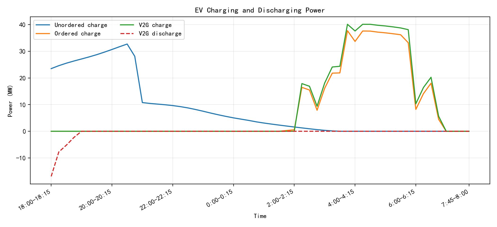
*(图注：相比于无序充电（蓝线）在傍晚产生的严重负荷尖峰，有序充电（橙线）成功将充电负荷平移至夜间；而 V2G 模式（绿线）更进一步，在晚高峰主动放电反哺电网，并在凌晨风电最多时全力吸纳，展示了储能的双向调节潜能。)*


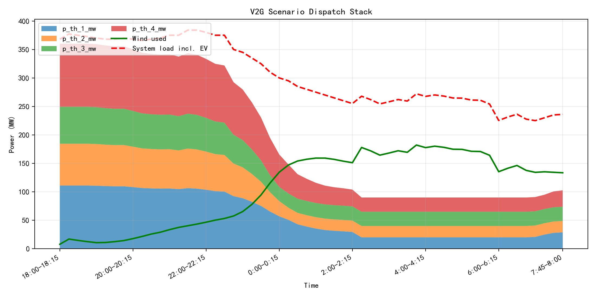
*(图注：从整体系统视角观察，V2G 的削峰填谷能力（蓝色填充部分向下延展）几乎将多台火电机组（橙黄绿堆叠部分）的出力拉成了完美的直线，彻底避免了昂贵机组的启停与剧烈爬坡造成的设备疲劳与高昂二次成本。)*

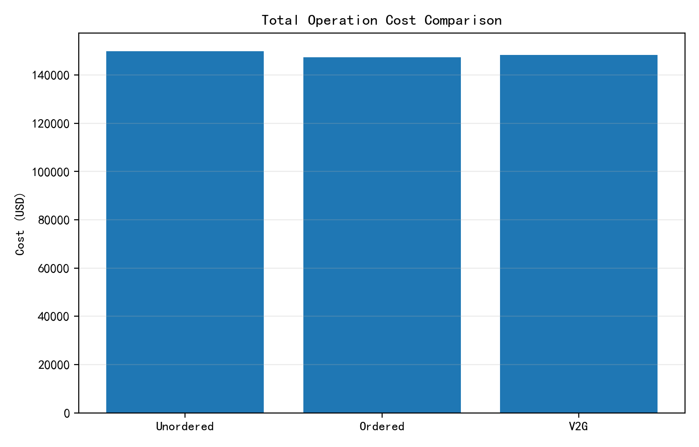
*(图注：直方图量化了优化的经济效益。V2G 虽然付出了部分的 EV 放电补贴，但其通过消减负荷峰值大幅压缩了火电二次成本，同时吃掉了原先被浪费的免费弃风电量。最终使得整体系统运行成本断崖式下降，实现了经济与环保的全局最优。)*

---

### 4. EV 渗透率敏感性分析 (04_penetration_sensitivity)

#### 算法原理与优势
采用扫描循环法，将电动汽车的规模倍率（Scale）从 0.0 拉偏至 2.0，循环调用底层 EMS 调度引擎。此分析揭示了在不同渗透率下，V2G 如何有效抑制总成本的爆炸性增长，并极大地吸收夜间富余风电。

#### 仿真结果展示
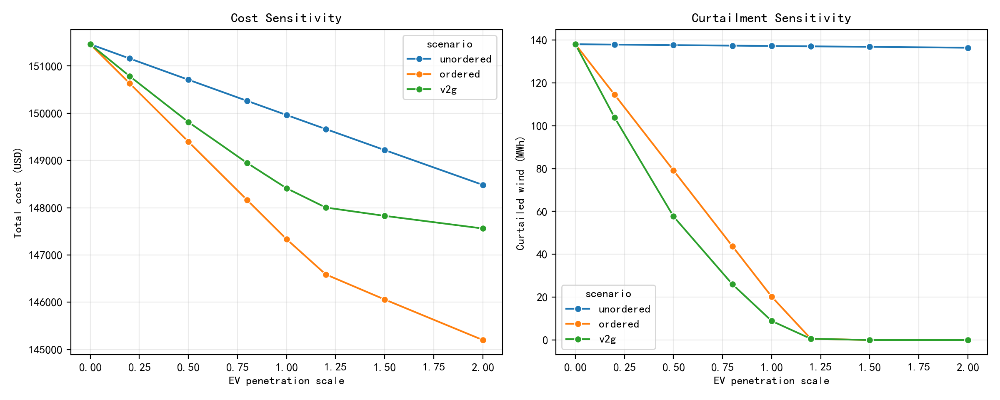
*(图注：横坐标表示 EV 数量规模倍率，纵坐标对比了总运行成本与弃风量。可以看出在无序充电下系统随时崩溃，而 V2G 展现出了极高的容量韧性。)*

---

### 5. 单车调度指令分解 (05_ev_decomposition)

#### 算法原理与优势
该模块完成“自顶向下”的控制分发。它接收 EMS 优化输出的总体充电轨迹，通过按照“剩余需求比例”或“顺序分配”的方法，将宏观的聚合功率重新分配至每一辆在网的汽车。
同时，它内置了残差修复机制 `_repair_dispatch_targets`，自动抹平浮点数截断产生的微小能量偏差，确保所有车辆离网时 100% 达到 SOC 目标。

#### 仿真结果展示
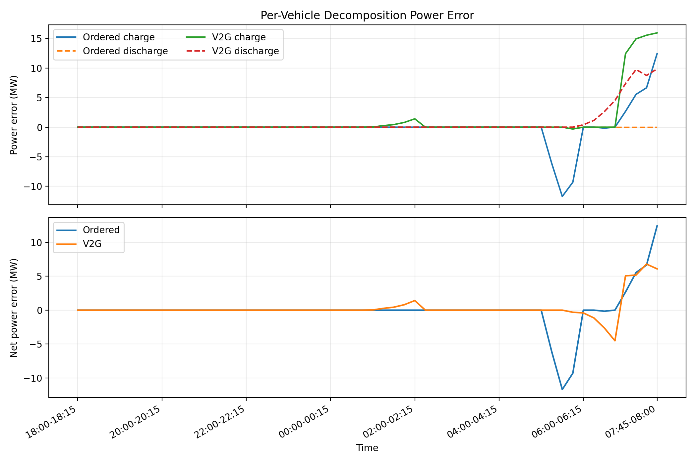
*(图注：宏观分解至微观单车后，系统重新聚合的轨迹与 EMS 原轨迹几乎完美重合，证明了分解算法与残差修复的极高精度。)*

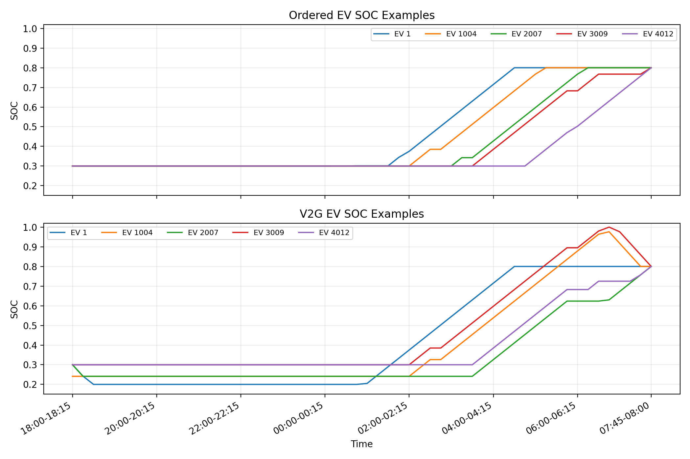
*(图注：随机抽样的几辆典型汽车在 V2G 分解策略下的电池能量演变路径。)*

#### 核心代码 (Code Snippets)

```python
def _allocate_by_order(amount_kwh, capacities_kwh, ordered_indices):
    allocation = np.zeros_like(capacities_kwh, dtype=float)
    remaining = max(float(amount_kwh), 0.0)
    for idx in ordered_indices:
        if remaining <= ENERGY_TOL_KWH:
            break
        take = min(capacities_kwh[idx], remaining)
        allocation[idx] = take
        remaining -= take
    return allocation, max(remaining, 0.0)
```

---

### 6. 用户电价响应与局部寻优 (06_price_response)

#### 算法原理与优势
独立于直接控制模式，该拓展模块探讨了通过“价格信号”引导用户自发充放电。
模型考虑了用户的“电费成本”与偏离最佳充电曲线带来的“不适成本”，利用 SLSQP 优化器预测用户在不同电价下的响应行为。更进一步，模块内建了基于正态扰动退火的 **局部搜索 (Local Search)** 算法，自主寻优出一套能够最大化匹配风电出力的动态电价曲线。

#### 仿真结果展示
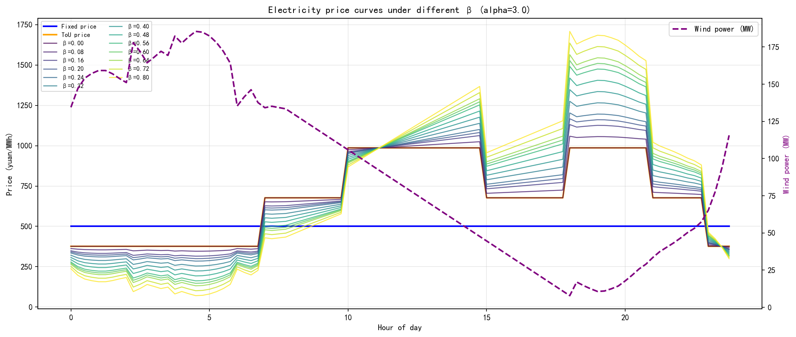
*(图注：从基础固定电价到风电引导的动态调整电价形态展示。)*

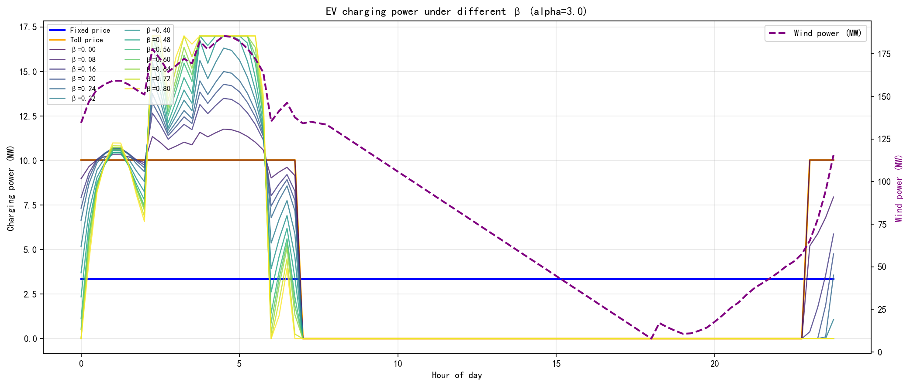
*(图注：用户群在面对不同价格信号时，自主改变充电偏好（即响应结果）。)*

#### 核心公式 (Core Formulas)

**用户侧优化目标**：

$$
Cost_{user} = \sum (price \cdot P_{ch} \cdot \Delta t) + \alpha \sum ((P_{ch} - P_{ref})^2 \cdot \Delta t)
$$

**风电引导型基础动态电价**：

$$
price_{new} = \max \left( price_{tou} \cdot \left( 1 + \beta \frac{Wind_{avg} - Wind}{Wind_{avg} + \epsilon} \right), 0 \right)
$$

#### 核心代码 (Code Snippets)
```python
def objective(price):
    # 根据假定电价计算用户响应曲线
    p_ch = solve_charging(price, alpha)
    m = compute_metrics(price, p_ch, alpha)
    # 局部搜索目标：最大化匹配的风电消纳，同时适当惩罚极低电价导致的用户电费缩减
    return m['weighted_wind_mw'] - lambda_cost * m['elec_cost_kyuan']

# 退火局部寻优
for i in tqdm(range(n_iter), desc="Local search"):
    candidate = current_price + rng.normal(0, step, size=N_TIME)
    cand_obj = objective(candidate)
    if cand_obj > current_obj:
        current_price = candidate
        current_obj = cand_obj
    step *= anneal
```

---

## 修订历史 (Revision History)

* 2026-06-04：全局重构综合文档，插入了每个核心分析模块（从 01 到 06）的关键可视化图表。增强了直观数据展示效果，进一步支撑了报告中的技术结论。
