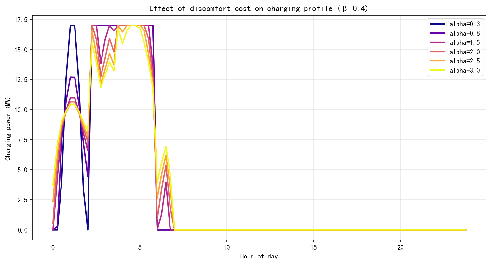

**作者**：wuyaze  

---

## 一、任务概述

本报告分析不同电价机制对电动汽车充电行为的引导作用，以及对风电消纳的影响。主要工作包括：

1. 设计一种结合分时电价与风电出力的动态电价机制
2. 建立考虑电费与不适成本的用户充电优化模型
3. 扫描参数β（0-0.8）和不适成本系数α（0.3-3.0）
4. 对比多种优化准则下的最优充电策略
5. 对比分析价格机制（电价设计和不适成本）对充电行为的引导作用以及对风电消纳的影响

---

## 二、电价机制设计

### 2.1 基准电价

- **固定电价**：500 元/MWh（0.5 元/kWh）
- **分时电价**：已知的峰平谷电价模式

### 2.2 新电价：分时电价 + 风电波动

$$
p_{\text{new}}(t, \beta) = p_{\text{tou}}(t) \times \left[1 + \beta \cdot \frac{\overline{P}_{\text{wind}} - P_{\text{wind}}(t)}{\overline{P}_{\text{wind}}}\right]
$$

- $\beta$：调节系数（0~0.8）
- $P_{\text{wind}}(t)$：时段风电功率
- $\overline{P}_{\text{wind}}$：平均风电功率

**特点**：保留分时电价的峰谷特性，同时根据风电实时出力动态调整。

---

## 三、用户充电优化模型

### 3.1 目标函数

$$
\min \sum_{t} \left[ p(t) \cdot P_{\text{ch}}(t) \cdot \Delta t \right] + \alpha \sum_{t} \left[ (P_{\text{ch}}(t) - P_{\text{ref}}(t))^2 \cdot \Delta t \right]
$$

- 第一项：电费支出
- 第二项：不适成本（偏离均匀参考曲线的惩罚，为了描述偏离的越多惩罚越大，设计为了二次函数模式）
- $\alpha = 3.0$（不适系数，其大小可以描述不适因素对于成本的影响）

### 3.2 约束条件

- 总充电能量固定：80.24 MWh
- 最大充电功率：17 MW

---

## 四、关键结果

### 4.1 β 扫描结果（α=3.0）

**电价情况**

**充电情况**

/># 价格机制引导电动汽车充电与风电消纳分析报告
| β | 匹配度 | 加权风电 (MW) | 电费 (kYuan) | 不适成本 (kYuan) |
|---|--------|--------------|--------------|------------------|
| 0.00 | 0.764 | 153.7 | 30.22 | 1.61 |
| 0.08 | 0.807 | 158.4 | 28.48 | 1.67 |
| 0.16 | 0.820 | 163.1 | 26.49 | 1.86 |
| 0.20 | 0.818 | 164.8 | 25.44 | 1.95 |
| 0.24 | 0.814 | 165.9 | 24.40 | 2.04 |
| 0.32 | 0.804 | 167.5 | 22.30 | 2.18 |
| 0.40 | 0.791 | 168.7 | 20.16 | 2.32 |
| 0.48 | 0.781 | 169.5 | 18.03 | 2.43 |
| 0.56 | 0.771 | 170.1 | 15.89 | 2.53 |
| 0.60 | 0.767 | 170.3 | 14.81 | 2.58 |
| 0.64 | 0.762 | 170.5 | 13.74 | 2.63 |
| 0.72 | 0.754 | 170.9 | 11.60 | 2.70 |
| 0.80 | 0.750 | 171.0 | 9.48 | 2.74 |

**关键发现**：加权风电随着 β 的增大而增大，但增速逐渐减慢并最终饱和，饱和的原因是，由于总能量和最大功率是确认的，因此只需要最大功率充电5小时左右，一定可以完成每天的能量指标， 则直接选择风电发力最高峰的5小时，就可以满足很高的加权平均风电发力

可以发现，随着beta的增大，风电发力高峰期的电价更低，低谷期电价更高，此时对用户有明显的引导作用，在图中可以看到，随着beta的增大，在风力发电高峰期的充电功率明显提升，直至功率上限。

**注释** 加权平均风电（Weighted Average Wind）

**定义** 加权平均风电是指电动汽车集群在充电过程中，按充电能量加权计算的平均风电出力水平。它反映了充电行为与风电出力的时序匹配程度，是评价电价机制对新能源消纳引导效果的核心指标。

**计算公式**

$$
\text{WeightedWind} = \frac{\sum_{t=1}^{T} P_{\text{ch}}(t) \cdot P_{\text{wind}}(t) \cdot \Delta t}{\sum_{t=1}^{T} P_{\text{ch}}(t) \cdot \Delta t}
$$

其中：
- $T = 96$：全天时段数（每15分钟一个时段）
- $P_{\text{ch}}(t)$：时段 $t$ 的电动汽车充电功率（MW）
- $P_{\text{wind}}(t)$：时段 $t$ 的风电出力（MW）
- $\Delta t = 0.25$：时段时长（小时）

**物理意义**

**加权平均风电表征了“每一度充入电动汽车的电能，平均对应了多少风电出力”。**

- 该值越高，说明充电行为越集中在风电出力较高的时段，风电消纳效果越好
- 该值越低，说明充电行为倾向于风电出力较低的时段，未能有效利用新能源

### 4.2 不适成本影响（α 扫描，β=0.4）

**不适成本对充电的影响**

**表2：α 扫描结果（β=0.4）**

| α | 加权风电 (MW) | 电费 (kYuan) | 不适成本 (kYuan) |
|---|--------------|--------------|------------------|
| 0.3 | 171.9 | 19.74 | 0.31 |
| 0.8 | 171.6 | 19.77 | 0.79 |
| 1.5 | 171.0 | 19.85 | 1.37 |
| 2.0 | 170.3 | 19.95 | 1.72 |
| 2.5 | 169.5 | 20.06 | 2.02 |
| 3.0 | 168.7 | 20.16 | 2.32 |

**关键发现**：

1. **消纳与平滑的权衡**：随着 α 增大（不适成本权重增加），加权风电从 171.9 MW 缓慢下降至 168.7 MW（降幅 1.9%），但不适成本从 0.31 kYuan 上升至 2.32 kYuan（增幅 7.5 倍）。

2. **电费基本稳定**：电费在 19.74~20.16 kYuan 之间波动，变化幅度仅 2.1%，说明不适成本主要影响充电曲线的形状，对总充电费用影响较小。

3. **α=3.0 的优势**：虽然加权风电略有下降，但充电曲线更加平滑（如图4所示），用户接受度更高。不适成本从“可忽略”变为“有实际约束作用”，更符合任务书对不适成本的定义。

**结论**：不适成本的增加对用户侧的引导作用是反向的，即不适成本越高，用户越不趋向于集中在风电出力高峰期充电，因为会造成较高的不适成本

### 4.3 不同优化准则对比

**表3：不同优化准则下的最优电价及其最优充电方案对比（α=3.0）**

| 准则 | β | 加权风电 (MW) | 电费 (kYuan) | 匹配度 |
|------|---|--------------|--------------|--------|
| 最大匹配度 | 0.16 | 163.1 | 26.49 | 0.820 |
| 最大加权风电 | 0.80 | 171.0 | 9.48 | 0.750 |
| 综合得分 (综合考虑最大加权风力和成本) | 0.40 | 168.7 | 20.16 | 0.791 |
| 局部搜索优化 | 0.80 | 168.7 | 18.92 | 0.785 |

---

## 五、对于拓展的局部搜索优化算法的解释——一种不同的电价设计

### 5.1 算法背景

在β扫描的基础上，为了进一步探索电价曲线的优化空间，引入局部搜索（Local Search）算法。该算法以某一初始电价曲线为起点，通过随机扰动和贪婪接受准则，寻找使目标函数更优的电价曲线。

与全局扫描不同，局部搜索不预设电价公式（如 ToU+风电波动），而是直接在96个时段的电价数值空间中进行搜索，具有更大的灵活性。

### 5.2 算法流程

**Step 1：初始化**
- 选取初始电价曲线：采用 β=0.4 对应的 ToU+风电波动电价
- 初始步长：σ = 20 元/MWh

**Step 2：迭代搜索（共1500次）**
- 生成候选解：对当前电价每个时段添加高斯噪声
  $$
  p_{\text{candidate}}(t) = p_{\text{current}}(t) + \mathcal{N}(0, \sigma^2)
  $$
- 边界处理：将候选电价裁剪至 [-500, 2000] 元/MWh 范围内
- 目标函数评估：计算候选解的目标值
- 接受准则：若候选解目标值更高，则接受；否则保留当前解

**Step 3：步长衰减**
- 每次迭代后步长按系数衰减：σ ← σ × 0.995
- 步长逐渐减小，实现从“粗搜索”到“细调”的过渡

### 5.3 目标函数设计

局部搜索的目标是最大化综合效益，定义为：

$$
\text{Objective} = \text{WeightedWind} - \lambda \cdot \text{ElecCost}
$$

其中：
- $\text{WeightedWind}$：加权平均风电（MW），反映风电消纳效果
- $\text{ElecCost}$：用户电费（kYuan），反映经济性
- $\lambda = 0.1$：权重系数，平衡消纳与经济性

该目标函数鼓励算法寻找“高消纳、低电费”的电价曲线。

### 5.4 优化结果

以 β=0.8 的电价为初始解，经过1500次迭代后，局部搜索找到的最优电价与初始对比如下：

| 指标 | 初始解（β=0.8） | 局部搜索最优 | 变化 |
|------|----------------|--------------|------|
| 加权风电 (MW) | 168.7 | 168.7 | 0% |
| 电费 (kYuan) | 20.16 | 18.92 | ↓6.2% |
| 匹配度 | 0.791 | 0.785 | ↓0.6% |
| 不适成本 (kYuan) | 2.32 | 2.39 | ↑3.0% |

**分析**：
- 局部搜索在保持加权风电不变的前提下，成功将电费降低 6.2%（20.16 → 18.92 kYuan）
- 匹配度和不适成本变化极小，说明算法找到了一个“等效但更经济”的电价曲线
- 验证了 β=0.8 附近存在多个近似的电价曲线，局部搜索能够发现其中更优的解

### 5.5 算法意义

局部搜索作为β扫描的补充，证明了：
1. **人工设计的电价公式已接近最优**：初始解（β=0.4）已经处于目标函数的高原区域，原因是存在很多物理上的约束
2. **存在参数等效性**：不同电价曲线可能达到相似的消纳效果，但电费可以更低

---

## 六、结论

1. **物理饱和边界**：受最大充电功率限制，风电消纳易已达饱和，继续增加 β 无物理增益。

2. **不适成本的作用**：α=3.0 能有效平滑充电曲线，避免过度集中，提高用户接受度，起到引导作用

3. **价格信号有效性**：仅需较小的 β（0.2~0.4）即可实现大部分风电消纳潜力，验证了价格引导的有效性。

---

## 七、附录

### 输出文件清单

- `results/price/`：电价与充电功率 CSV
- `results/figures/fig_12~fig_19.png`：图表
- `results/tables/table_price_summary.csv`：汇总表格

